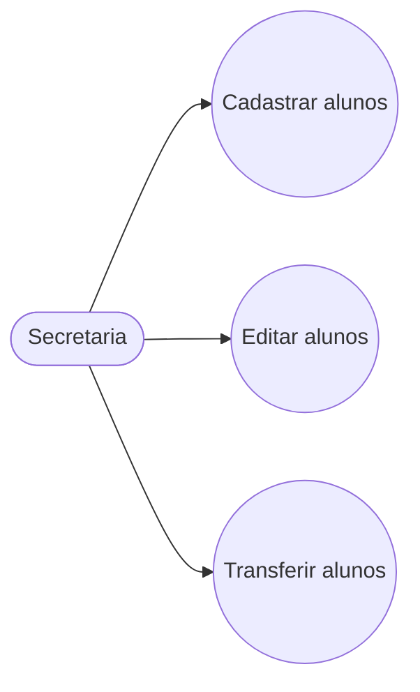
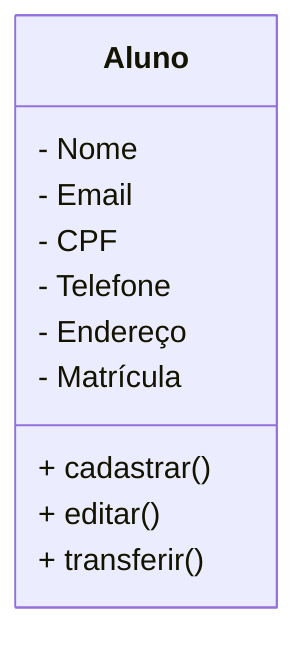

Modelagem em Orientação à Objetos
das Entidades Alunos, Cursos e 
Turmas.

## Casos de Uso

## Diagrama de Classes

## Dependências
- **VSCode**: IDE (Interface de Desenvolvimento)

- **Mermaid**: Linguagem para 
confecção de Diagramas em 
documentos MD (Mark Down)

- **Material Icon Theme**:Tema para as Colorir as 
pastas.

- **GIt Lens**: Interface gráfica para o
versionamento .git integrado ao VSCode. 
