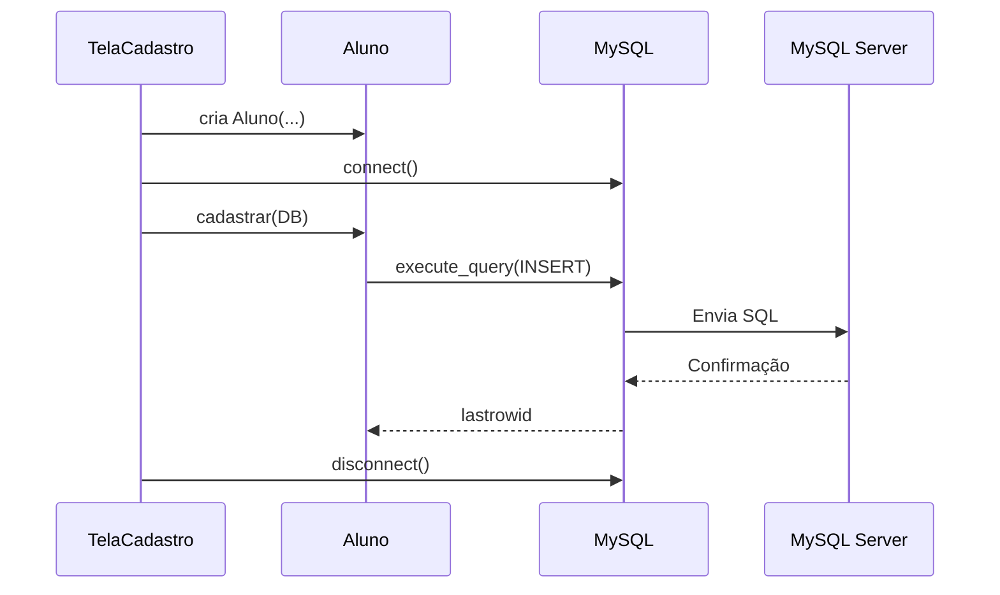
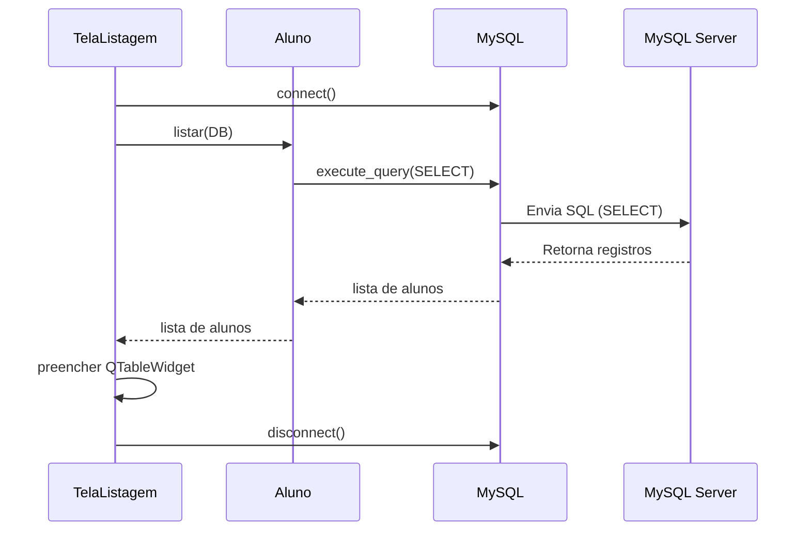

## Diagrama de Sequência - **Cadastro**

```mermaid
sequenceDiagram 
    participant UI as TelaCadastro 
    participant Entidade as Aluno 
    participant DB as MySQL 
    participant Banco as MySQL Server 

    UI ->> Entidade: cria Aluno(...) 
    UI ->> DB: connect() 
    UI ->> Entidade: cadastrar(DB) 
    Entidade ->> DB: execute_query(INSERT) 
    DB ->> Banco: Envia SQL 
    Banco -->> DB: Confirmação 
    DB -->> Entidade: lastrowid 
    UI ->> DB: disconnect()
```
## Diagrama de Sequência - **Listagem**

```mermaid
sequenceDiagram
    participant UI as TelaListagem
    participant Entidade as Aluno
    participant DB as MySQL
    participant Banco as MySQL Server

    UI ->> DB: connect()
    UI ->> Entidade: listar(DB)
    Entidade ->> DB: execute_query(SELECT)
    DB ->> Banco: Envia SQL (SELECT)
    Banco -->> DB: Retorna registros
    DB -->> Entidade: lista de alunos
    Entidade -->> UI: lista de alunos
    UI ->> UI: preencher QTableWidget
    UI ->> DB: disconnect()
```

